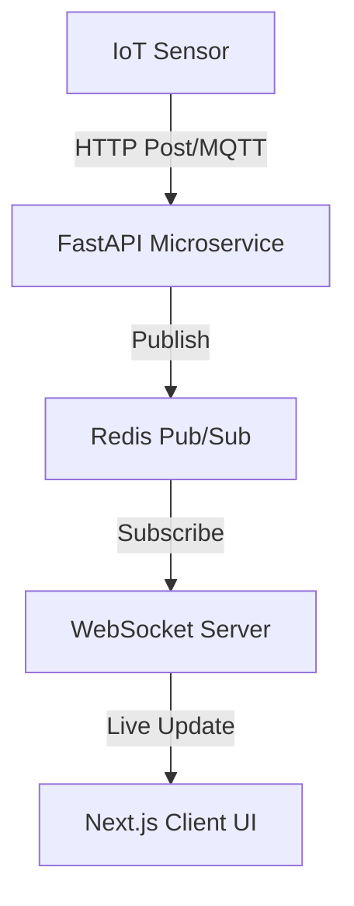

Smart city infrastructure relies on immediate synchronization between hardware states (sensors) and software clients (driver dashboards). In a Smart Parking platform, when an IoT sensor detects a vehicle exiting a stall, that availability must propagate to all waiting drivers within milliseconds.

Conversely, if multiple drivers attempt to book the last available parking slot at the exact same fraction of a second, the system must guarantee that only one succeeds.

In this article, we'll cover the concurrency patterns, WebSockets, and locking mechanisms designed to run these high-speed platforms.

---

## The Synchronization Pipeline

To represent slot availability in real time, our architecture maps sensor updates through a low-latency event loop:



By decoupling the sensor inputs from client web sockets via Redis Pub/Sub, the system easily handles thousands of active client connections without bottlenecking the main database.

---

## Dealing with Race Conditions: The Double Booking Problem

Consider this scenario: two users tap "Reserve" on the exact same parking slot simultaneously. 
Without concurrency management, the database execution might follow this path:

1.  **User A checks availability**: Database returns `true`.
2.  **User B checks availability**: Database returns `true`.
3.  **User A updates slot to occupied**: Booking created successfully.
4.  **User B updates slot to occupied**: Booking created successfully (Overwriting or doubling the slot allocation).

This is a classic **Race Condition**. To resolve this, we use two locking strategies:

### 1. Pessimistic Locking (Database Level)

In PostgreSQL, we can lock rows during a transaction, forcing other queries to wait until the current transaction commits or rolls back.

```sql
-- Lock the row for update, preventing read/write by other transactions
SELECT * FROM parking_slots 
WHERE id = $1 AND status = 'AVAILABLE' 
FOR UPDATE;
```

In our code using Prisma ORM, we can enforce raw queries or transaction level assertions:

```typescript
const slot = await prisma.$transaction(async (tx) => {
  // 1. Fetch and lock row using PostgreSQL FOR UPDATE
  const lockedSlot = await tx.$queryRaw`
    SELECT * FROM "ParkingSlot" 
    WHERE id = ${slotId} AND status = 'AVAILABLE' 
    FOR UPDATE
  `;
  
  if (!lockedSlot || lockedSlot.length === 0) {
    throw new Error("Slot already reserved or occupied");
  }

  // 2. Perform booking allocation
  const booking = await tx.booking.create({
    data: {
      userId,
      parkingSlotId: slotId,
      expiresAt: new Date(Date.now() + 15 * 60 * 1000) // 15 mins expiry
    }
  });

  // 3. Update slot status
  await tx.parkingSlot.update({
    where: { id: slotId },
    data: { status: 'RESERVED' }
  });

  return booking;
});
```

### 2. Distributed Locking with Redis (Application Level)

For high-throughput applications where direct database queries are expensive, we can use Redis as a high-speed lock coordinator. We write a lock key that expires automatically if the network goes down.

```python
import redis
import time

r = redis.Redis(host='localhost', port=6379, db=0)

def acquire_slot_lock(slot_id, user_id, acquire_timeout=3, lock_timeout=10):
    lock_key = f"lock:slot:{slot_id}"
    end_time = time.time() + acquire_timeout
    
    while time.time() < end_time:
        # SET NX: set only if key does not exist. PX: milliseconds expiration.
        if r.set(lock_key, user_id, nx=True, px=lock_timeout * 1000):
            return True
        time.sleep(0.1)
    return False

def release_slot_lock(slot_id, user_id):
    lock_key = f"lock:slot:{slot_id}"
    # Lua script to guarantee atomicity: only release if we own the lock
    lua_release = """
    if redis.call("get", KEYS[1]) == ARGV[1] then
        return redis.call("del", KEYS[1])
    else
        return 0
    end
    """
    r.eval(lua_release, 1, lock_key, user_id)
```

> [!IMPORTANT]
> The Lua release script is critical. If User A's transaction takes longer than the lock timeout, the lock will expire, and User B might acquire it. When User A finally finishes, they must NOT release the lock now owned by User B. The Lua check ensures they only release their own lock.

---

## FastAPI WebSocket Handler: streaming real-time status

FastAPI is ideally suited for WebSockets due to its native `asyncio` loop and high-performance ASGI server (Uvicorn). Here is how the live updating endpoint streams slot states:

```python
from fastapi import FastAPI, WebSocket, WebSocketDisconnect
from typing import List

app = FastAPI()

class ConnectionManager:
    def __init__(self):
        self.active_connections: List[WebSocket] = []

    async def connect(self, websocket: WebSocket):
        await websocket.accept()
        self.active_connections.append(websocket)

    def disconnect(self, websocket: WebSocket):
        self.active_connections.remove(websocket)

    async def broadcast(self, message: str):
        for connection in self.active_connections:
            try:
                await connection.send_text(message)
            except Exception:
                # Handle stale connections
                pass

manager = ConnectionManager()

@app.websocket("/ws/parking")
async def websocket_endpoint(websocket: WebSocket):
    await manager.connect(websocket)
    try:
        while True:
            # Keep connection alive; handle incoming messages if any
            data = await websocket.receive_text()
    except WebSocketDisconnect:
        manager.disconnect(websocket)
```

---

## Summary

Combining low-latency **Uvicorn WebSockets** for live UI synchronization, and **PostgreSQL transactions** alongside **Redis locks** for transactional integrity, yields a bulletproof architecture. With these patterns, slot availability remains consistent and double bookings are mathematically eliminated.
